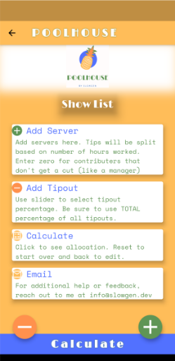
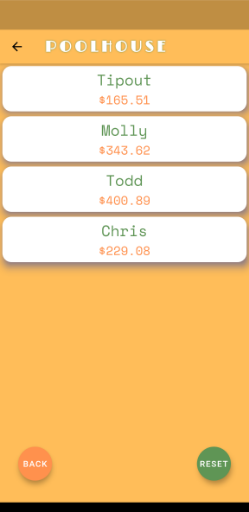

# 🍍 POOLHOUSE 🍍

A light-weight tool for servers and bartenders to split their tips.

# 🚀 Closed testing now available on Google Play, email kali@kali.nyc for access 🚀

## About the app

Poolhouse is an app designed to aid servers and bartenders in splitting their tips.

In many bars and restaurants, the staff often pool their tips and split them according to various metrics, usually by hours worked. This means that everyone can help each other out and still get a fair share, no matter how much or how little time they work.

For example, let's say we have three bartenders working together, Molly, Todd and Chris. They also have helpers who gets a 17% cut of all their tips for the whole shift. Molly gets to work first and leaves when it's not busy anymore. Today she worked 6 hours. Next to come in is Todd, he usually stays until the end and closes up shop. Today he worked 7 hours. Then we have Chris, Chris only comes in for the busiest part of the day and today worked just 4 hours.

Even though all three are working together and sharing in the work equally, the credit card machine only reports tips on who entered them in the system. Molly's report shows $250.50 in earned tips, Todd has $576.34 and Chris, $346.15.

## *How do we know who gets to keep what?*

Dividing up the tips fairly comes down to a bunch of simple math, but who wants to do that after a long busy night? This is where Poolhouse comes in to help!

Users are greeted first with a quick set of instructions, with easy access buttons at the bottom to get started.

Tapping on the ➕ brings up the ADD SERVER screen where the user can type in the name, hours worked and tips earned.

All servers are responsively rendered on our primary screen, where the user can remove or continue adding

Now we don't want to forget our helpers! Next the user can add a tipout percentage by tapping the ➖.

Now we are ready to tap CALCULATE and we get our results!

If we make a mistake, we can go back and edit our list or we can tap reset and start from scratch.

---------

## Tech Stack

Poolhouse is built using Flutter with Provider for global state management. It has no other dependences, does not require access to the internet or any other special permissions. Easy as getting your piece of the pie!

------

Poolhouse 🍍 ©️ Slowgen 2021

Check out my other work at [http://kali.nyc](http://kali.nyc)

